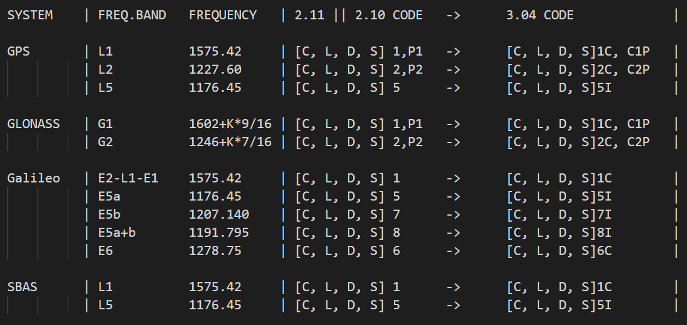

- [中文](ReadmeCN.md)
- [English](Readme.md)
### Using method ###

Click to open KNZ_Convert_en_us_ver_1.0.6.exe of english version.

Click "Single file convert" or "Batch files convert", input the RINEX file of version of 2.10 or 2.11.

If not click the output diectory, the converted file will generate at the same directory of original file, 
the file name of converted file is "COV-{originalfilename}"

The converted file will note the version of convert at the heder of file.

The converted file own some traits as below:

1. Conversion does not require additional parameter information,
the file is lossless conversion, only convert the foemat,
do not modify the information. 
2. The double character observation types of RINEX2.xx version will be automatically matched according to the following table:

